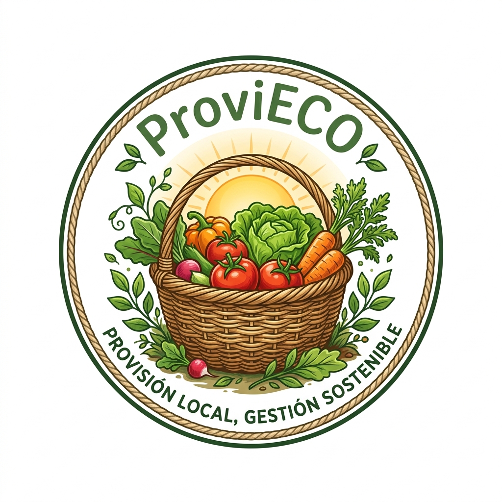

# ProviECO

<p align="center">
   
</p>

## Autora

**Paola Viera Suárez**

Trabajo de Fin de Grado
Ingeniería Informática
Escuela de Ingeniería Informática
Universidad de Las Palmas de Gran Canaria

---

## Descripción del proyecto

**ProviECO** es una aplicación web y móvil progresiva orientada a la planificación y gestión del suministro de productos agroalimentarios locales para entidades de restauración colectiva, como colegios, hospitales, residencias o comedores.

El proyecto nace con el objetivo de facilitar la conexión entre productores locales y centros que necesitan organizar pedidos de alimentos de forma anticipada, sostenible y trazable. La aplicación permite gestionar productos, certificados ecológicos, pedidos planificados, EcoBoxes y validaciones administrativas.

Además, ProviECO incorpora una adaptación móvil mediante PWA, lo que permite instalar la aplicación en un dispositivo móvil y utilizarla desde la pantalla de inicio como si fuera una app.

---

## Objetivo principal

Diseñar y desarrollar una aplicación web y móvil para la planificación y gestión del suministro de productos agroalimentarios locales, orientada a restauración colectiva, incorporando funcionalidades de validación, trazabilidad, planificación de pedidos y gestión sostenible.

---

## Funcionalidades principales

### Gestión de usuarios

La aplicación cuenta con diferentes roles:

* **Administrador**
* **Productor**
* **Cliente**
* **Restauración colectiva**

Cada tipo de usuario dispone de permisos y funcionalidades adaptadas a su papel dentro del sistema.

---

### Productores

Los productores pueden:

* Registrarse e iniciar sesión.
* Acceder a su panel privado.
* Gestionar sus productos.
* Añadir información de origen y finca.
* Subir certificados ecológicos en PDF.
* Consultar el estado de validación de sus productos.
* Revisar pedidos recibidos.
* Actualizar el estado de suministro.
* Consultar feedback asociado a sus productos.

---

### Restauración colectiva

Los usuarios de restauración colectiva representan centros como colegios, hospitales, residencias o comedores.

Pueden:

* Registrarse como centro de restauración colectiva.
* Subir un documento acreditativo del centro.
* Esperar la validación del administrador.
* Consultar productos validados.
* Crear pedidos planificados.
* Indicar número de comensales.
* Definir fechas de entrega.
* Crear EcoBoxes recurrentes.
* Consultar el estado de sus pedidos.

Los centros pendientes o rechazados no pueden crear pedidos planificados ni EcoBoxes. De esta forma, se garantiza que solo las entidades validadas puedan utilizar las funcionalidades específicas de restauración colectiva.

---

### Panel de administración

El administrador puede:

* Validar o rechazar productos.
* Revisar certificados ecológicos.
* Validar o rechazar centros de restauración colectiva.
* Revisar documentos acreditativos.
* Añadir observaciones administrativas.
* Controlar qué productos aparecen públicamente en la plataforma.
* Supervisar el funcionamiento general del sistema.

---

### Productos

Cada producto puede incluir:

* Nombre.
* Categoría.
* Provincia de origen.
* Finca de origen.
* Precio.
* Stock disponible.
* Imagen.
* Certificado ecológico.
* Estado de validación.
* Información de trazabilidad.

Solo los productos validados por el administrador pueden aparecer en las zonas públicas de consulta.

---

### Pedidos planificados

La aplicación permite crear pedidos adaptados a las necesidades reales de centros de restauración colectiva.

Los pedidos planificados incluyen:

* Producto solicitado.
* Cantidad.
* Fecha de entrega.
* Centro solicitante.
* Número de comensales.
* Estado del pedido.
* Estado de suministro por parte del productor.

Esta funcionalidad permite a los centros organizar sus compras con antelación y facilita a los productores prever la demanda.

---

### EcoBox

La funcionalidad **EcoBox** permite crear cestas recurrentes de productos locales.

Cada EcoBox puede configurarse con:

* Nombre de la cesta.
* Productos incluidos.
* Periodicidad semanal, quincenal o mensual.
* Fecha de inicio.
* Centro asociado.
* Información de planificación.

Esta funcionalidad está pensada para facilitar compras repetidas y previsibles en centros con necesidades constantes.

---

### Trazabilidad

ProviECO incorpora trazabilidad básica por lote, permitiendo consultar información relevante del producto desde su origen hasta su entrega.

Esta funcionalidad mejora la transparencia del sistema y permite conocer mejor el recorrido de los productos agroalimentarios.

---

### PWA y uso móvil

La aplicación se ha adaptado como **Progressive Web App** mediante el archivo `manifest.webmanifest`.

Esto permite que ProviECO pueda instalarse en dispositivos móviles y utilizarse desde la pantalla de inicio como una aplicación, manteniendo una experiencia similar a una app móvil sin necesidad de desarrollar una aplicación nativa independiente.

---

## Tecnologías utilizadas

### Frontend

* Angular
* TypeScript
* HTML
* CSS
* Progressive Web App

### Backend

* Django
* Django REST Framework
* Python
* SQLite en entorno de desarrollo
* Sistema de migraciones de Django

### Herramientas adicionales

* Git
* GitHub
* Certificados PDF
* Imágenes de productos locales
* Diseño responsive

---

## Estructura del proyecto

```txt
ProviECO_TFG/
│
├── backend/
│   ├── users/
│   ├── products/
│   ├── orders/
│   ├── manage.py
│   └── requirements.txt
│
├── frontend/
│   ├── src/
│   │   ├── app/
│   │   ├── assets/
│   │   ├── environments/
│   │   └── manifest.webmanifest
│   ├── package.json
│   └── angular.json
│
├── REVISION_CUMPLIMIENTO_TFT01.md
├── USUARIOS_Y_DATOS_PRUEBA.md
├── README.md
├── .gitignore
├── package.json
└── requirements.txt
```

---

## Instalación y ejecución

### Requisitos previos

Para ejecutar el proyecto es necesario tener instalado:

* Python 3
* Node.js
* npm
* Angular CLI
* Git

---

## Ejecución del backend

Entrar en la carpeta del backend:

```bash
cd backend
```

Crear un entorno virtual:

```bash
python -m venv venv
```

Activar el entorno virtual en macOS o Linux:

```bash
source venv/bin/activate
```

Activar el entorno virtual en Windows:

```bash
venv\Scripts\activate
```

Instalar dependencias:

```bash
pip install -r requirements.txt
```

Aplicar migraciones:

```bash
python manage.py migrate
```

Ejecutar el servidor:

```bash
python manage.py runserver
```

El backend estará disponible en:

```txt
http://127.0.0.1:8000/
```

---

## Ejecución del frontend

Entrar en la carpeta del frontend:

```bash
cd frontend
```

Instalar dependencias:

```bash
npm install
```

Ejecutar la aplicación:

```bash
ng serve
```

La aplicación estará disponible en:

```txt
http://localhost:4200/
```

---

## Uso básico de la aplicación

### Productor

1. Registrarse como productor.
2. Acceder al panel de productor.
3. Crear productos.
4. Subir certificado ecológico.
5. Esperar la validación del administrador.
6. Consultar pedidos recibidos.
7. Actualizar el estado de suministro.

---

### Restauración colectiva

1. Registrarse como centro de restauración colectiva.
2. Subir documento acreditativo del centro.
3. Esperar la validación del administrador.
4. Consultar productos disponibles.
5. Crear pedidos planificados.
6. Crear EcoBoxes recurrentes.
7. Consultar el estado de sus pedidos.

---

### Administrador

1. Acceder al panel de administración.
2. Revisar productos pendientes.
3. Validar o rechazar certificados ecológicos.
4. Revisar centros de restauración colectiva.
5. Validar o rechazar documentos acreditativos.
6. Controlar la información visible en la plataforma.

---

## Documentación incluida

El repositorio incluye varios documentos de apoyo para la revisión y defensa del TFG:

* `PRUEBAS_TFG.md`: guion de pruebas y demostración práctica.
* `REVISION_CUMPLIMIENTO_TFT01.md`: revisión de cumplimiento respecto a la propuesta inicial.
* `TFG_CAMBIOS_REALIZADOS.md`: resumen de cambios realizados durante el desarrollo.
* `USUARIOS_Y_DATOS_PRUEBA.md`: usuarios y datos de prueba para la demostración.

---

## Datos de prueba

El sistema incluye usuarios y productos de prueba orientados a la defensa y validación del proyecto.

Ejemplos de perfiles utilizados:

* Productores locales.
* Administrador del sistema.
* Centro de restauración colectiva.
* Productos agroalimentarios de gran formato.
* Certificados ecológicos.
* Documentos acreditativos de centros.

Los datos concretos se encuentran descritos en el archivo:

```txt
USUARIOS_Y_DATOS_PRUEBA.md
```

---

## Validaciones implementadas

La aplicación incorpora distintas validaciones para garantizar un funcionamiento controlado:

* Validación de productos por parte del administrador.
* Validación de certificados ecológicos.
* Validación de centros de restauración colectiva.
* Bloqueo de funcionalidades para centros pendientes o rechazados.
* Control de cantidades positivas.
* Control de fechas de entrega no pasadas.
* Visibilidad pública solo de productos validados.
* Separación de permisos por rol de usuario.

---

## Cambios respecto a la propuesta inicial

Durante el desarrollo se realizaron varios cambios para mejorar la viabilidad y calidad del proyecto:

* Cambio del nombre del proyecto de EcoMarket a ProviECO.
* Evolución del enfoque agrícola hacia un enfoque agroalimentario.
* Sustitución de Ionic/Firebase por una arquitectura Angular + Django.
* Incorporación del rol de restauración colectiva.
* Validación documental para centros.
* Validación de certificados ecológicos.
* Incorporación de EcoBoxes.
* Incorporación de pedidos planificados.
* Mejora de la trazabilidad.
* Adaptación PWA para uso móvil.

Estos cambios se encuentran explicados con más detalle en:

```txt
TFG_CAMBIOS_REALIZADOS.md
REVISION_CUMPLIMIENTO_TFT01.md
```

---

## Estado del proyecto

El proyecto se encuentra en estado funcional para su presentación y defensa.

Incluye:

* Aplicación web operativa.
* Adaptación móvil mediante PWA.
* Backend con modelos, migraciones y endpoints.
* Frontend con pantallas principales.
* Gestión de usuarios por roles.
* Validaciones administrativas.
* Documentación de pruebas.
* Datos de demostración.

---

## Posibles mejoras futuras

Como líneas de mejora futura se plantean:

* Despliegue completo en un entorno cloud.
* Integración con pasarelas de pago.
* Notificaciones automáticas por correo.
* Panel estadístico avanzado.
* Sistema de recomendaciones de productos.
* Mejoras en la trazabilidad mediante códigos QR.
* Optimización de la experiencia móvil.
* Integración con mapas para visualizar productores por zona.

---

## Licencia

Este proyecto ha sido desarrollado con fines académicos como parte de un Trabajo de Fin de Grado.


